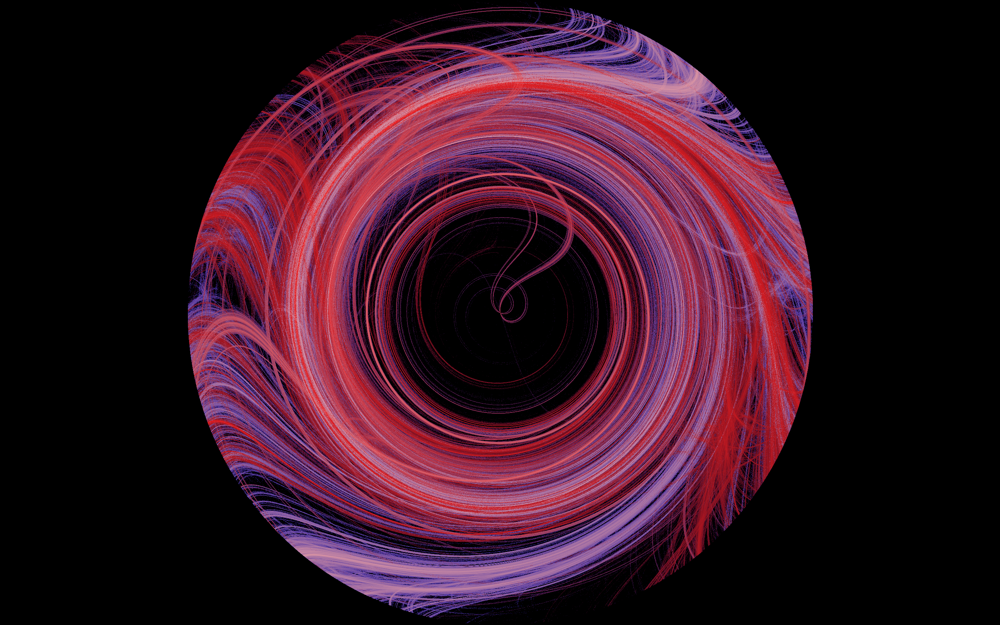
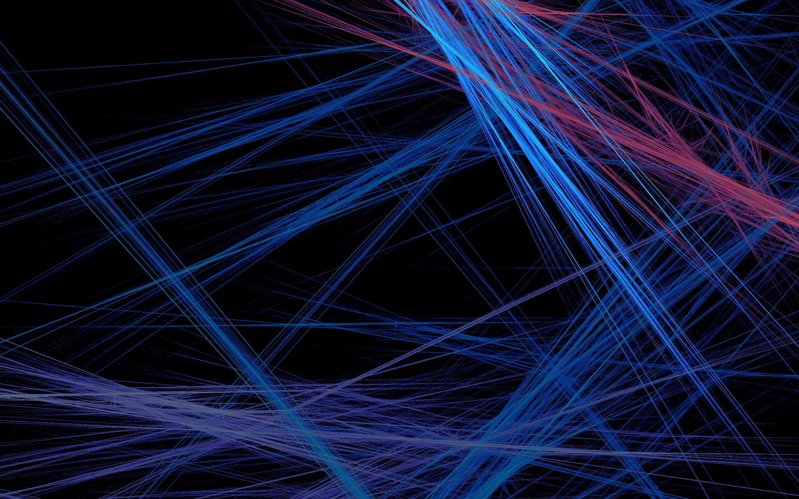
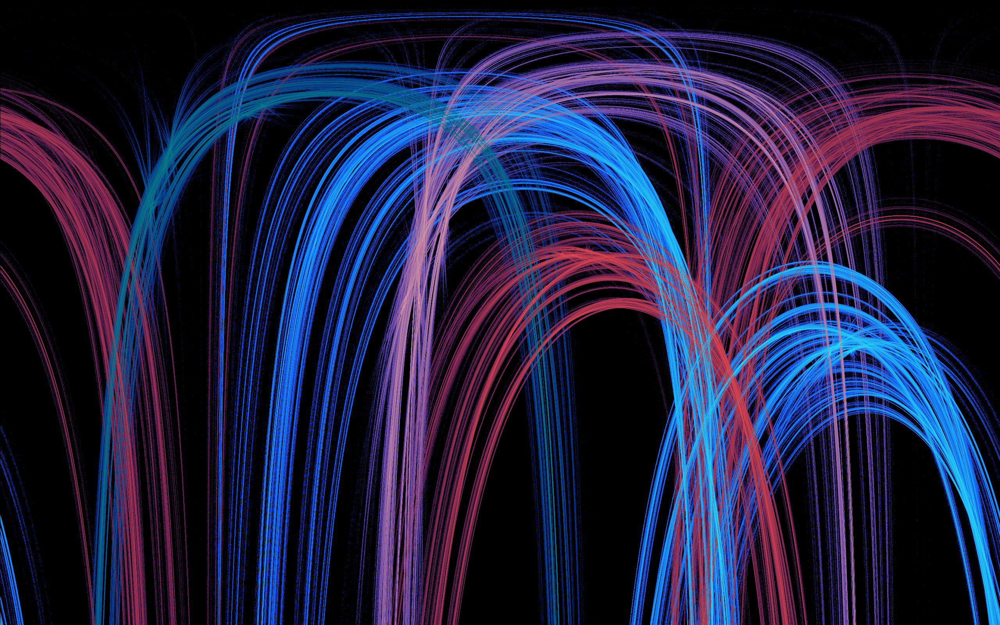

# ❤️‍🔥 Fractal Flame


Fractal flame is an algorithm proposed by Scott Draves that uses iterated function systems (IFS) to build images. 

Due to different seed values for the pseudorandom number generator, many different “pictures” can be obtained. Although fractality is not always visible in them, the results are very interesting.

<a href="https://flam3.com/flame_draves.pdf">More info</a>

## Features

- Single-thread and multy-thread image rendering
- Symmetrical rendering
- Image transformation types: (Disc, Heart, Linear, Polar, Sinusoidal, Spherical)
- Image normalization

## Build and run

Build program
```shell
mvn clean package assembly:single
```

Generate one image
```shell
java -jar target/flame-jar-with-dependencies.jar --generate
```

Generate many images and get benchmark_report.md
```shell
java -jar target/flame-jar-with-dependencies.jar --generate
```

See other flags
```shell
java -jar target/flame-jar-with-dependencies.jar
```

## Image Rendering Benchmark Report

| | Single-threaded Rendering | Multi-threaded Rendering|
|---|---|---|
| **Average time per image:** | 30894.8 ms | 7091.2 ms |

## Examples

Disc

Heart

Heart-symmetrical

Linear

Polar

Sinusoidal

Spherical

Spherical-symmetrical

